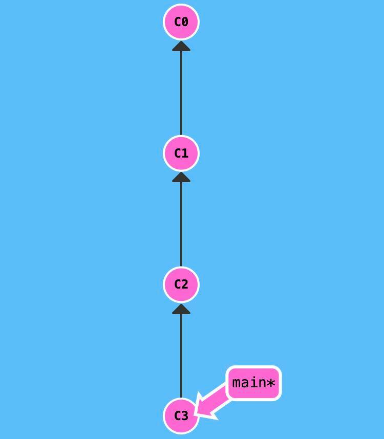
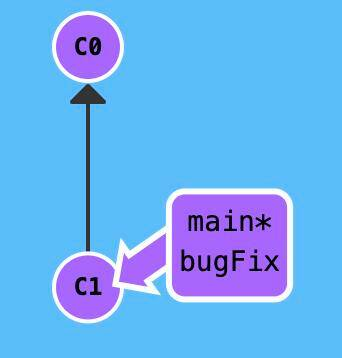

# **Git для новичков (часть 2)**

В [прошлой статье](https://habr.com/ru/articles/541258/), я рассказал, что такое Git, как его установить и выложить свой код на GitHub. Сегодня мы поговорим про работу в команде над одним проектом. И как это устроено в Git.

В данной статье, вся работа с Git будет через командную строку.

## **1. Совместная работа**

Представим, что вы с друзьями придумали проект, с "блэкджеком" и ... Вы разделили обязанности. Кто-то будет делать авторизацию и регистрацию, а кто-то функционал вывода новостей. Для этого вам пригодится ветвление.



**Ветка** - это набор commit (кружок), которые идут друг за другом. У ветки есть название, основную ветку чаще всего называют master (на картинках будет называться main) . Если говорить простыми словами, то ветка master - это наш проект.

Другие ветки - это отдельное место для реализации нового функционала или исправление багов (ошибок) нашего проекта. То есть, с отдельной веткой вы делаете что угодно, а затем сливаете эти изменения в основную ветку master.

? Не рекомендую создавать commit напрямую в master . Лучше для этого заводить новую ветку и все изменения писать там.

Для того, чтобы создать новую ветку вводим:

```
git branch <название_ветки>

#или вот так

git checkout -b <название_ветки>
```



Эти команды делают тоже самое, только второй вариант позволяет сразу переключиться в новую ветку. Вносить изменения в новую ветку можно сразу после ее создания.

При создании новой ветки, старайтесь называть ее кратким и ёмким именем. Чтобы сразу было понятно, что именно изменялось по проекту. Если вы используете, какую-нибудь систему для ведения задач, то можете в начале названия ветки указывать ID задачи, чтобы можно было легко найти, на основе какой задачи была создана ветка. Например вот так:

```
3424_fix_catalog_ajax
```

В каждом новом commit следует оставлять коммент и в нем описывать суть изменений.

Переключаться между ветками можно такой командой:

```
git checkout <название_ветки>
```

После того, как вы завершили работу над своей задачей, ветку можно слить в master . Для этого нужно переключиться в ветку master и выполнить следующую команду:

```
# Переключаемся в master
git checkout master
# Обновляем локальную ветку с сервера
git pull origin master

# Делаем merge вашей ветки, в ветку в которой вы находитесь
# В данном примере это master
git merge <название_ветки>
```