## 3. Работа с удалёнными репозиториями на примере github.com ##

### 3.1 Создание удалённого репозитория на github.com и загрузка в него локального репозитория ###

Для организации коллективной работы над проектом, *git* имеет мощный инструментарий для работы над удалёнными репозиториями. Удалённый репозиторий может быть, как на личном компьютере, так и сервере локальной сети или в облачном сервисе. Одним из самых популярных интернет ресурсов для работы с удалёнными репозиториями является *github.com*, где сообщество программистов делится собственными наработками, улучшает и модифицирует уже имеющиеся репозитории ит.д. 

Для создания репозитория на *github.com* нужно перейти во вкладку *your repositories* и кликнуть *new*, в следующем окне ввести название репозитория, указать дополнительные настройки (видимость репозитория, добавление описания в README.MD ит.д.), под конец кликнуть на *Create repository*.

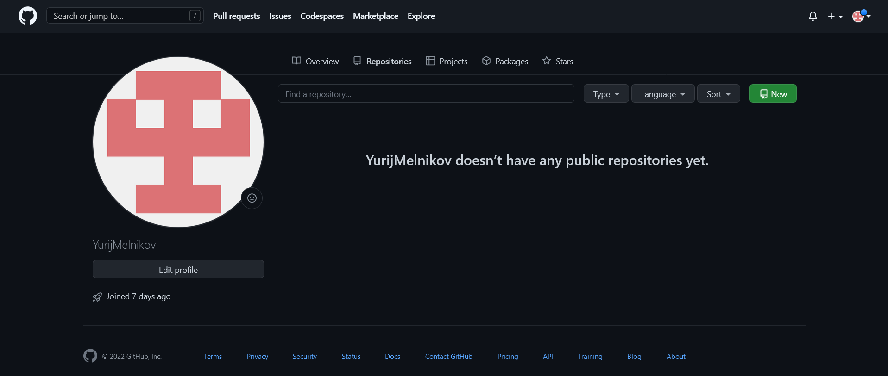

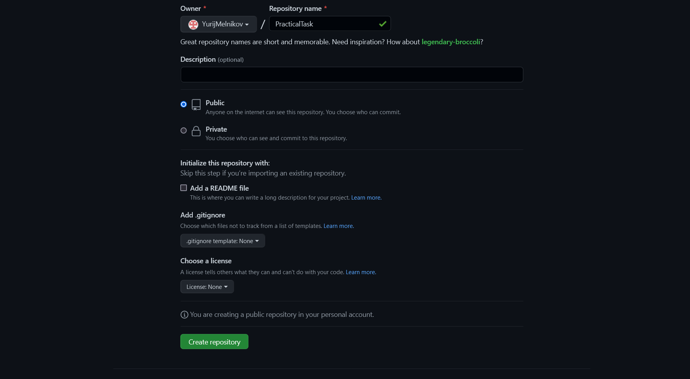

В итоге мы получили пустой репозиторий на *github.com* в который можно загрузить свой локальный. URL адрес является уникальным идентификатором этого репозитория, с которым мы в дальнейшем будем настраивать *git*.

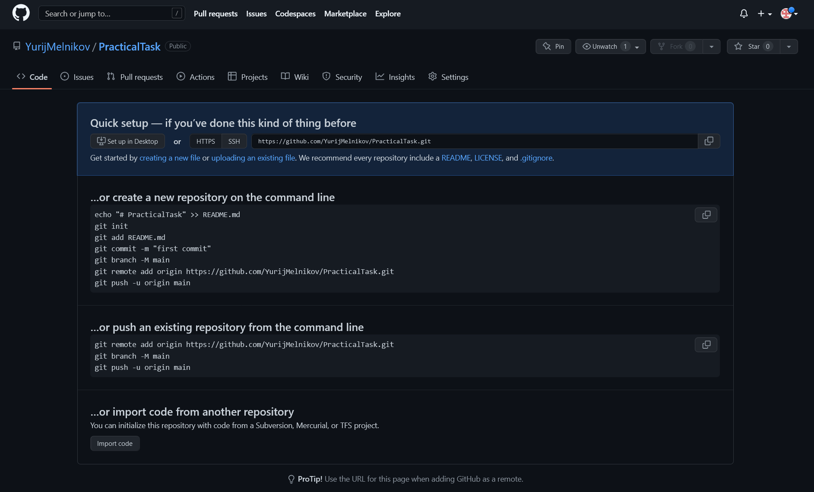

Для связи удалённого репозитория c *git* на локальном компьютере существует команда:

>git remote add <имя> <URL удалённого репозитория>

где: "имя" - короткое, произвольное название удалённого репозитория, к которому будет проще обращаться в командной строек, и URL - интернет адрес удалённого репозитория.

Так же команда *git  remote* без модификаторов отображает весь список, связанных с локальным компьютером, удалённых репозиториев. Ключ *-v* позволяет просмотреть адреса для чтения и записи, привязанные к репозиторию.

>git remote

>git remote -v

Например:

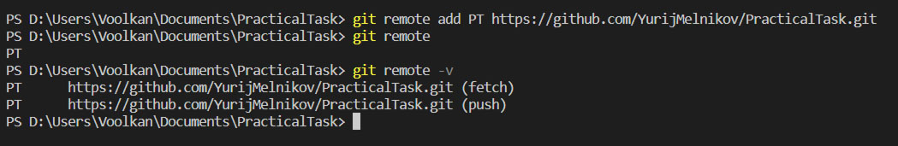

Командой *git remote add* связали локальный компьютер с удалённым репозиторием с адресом [https://github.com/YurijMelnikov/PracticalTask.git](https://github.com/YurijMelnikov/PracticalTask.git "https://github.com/YurijMelnikov/PracticalTask.git") и присвоили ему локальное, короткое имя *PT*. Проверили, что всё прошло успешно командой *git remote* и *git remote -v*.

Для загрузки в удалённый репозиторий данных из локального репозитория существует команда *push* чаще всего использующаяся в формате:

>git push <имя удалённого репозитория> <имя ветки>

Где, имя удалённого репозитория - это короткое имя, которое мы присвоили командной git remote. А имя ветки - соответственно имя ветки локального репозитория, которую нужно загрузить в удалённый репозиторий.

Например:

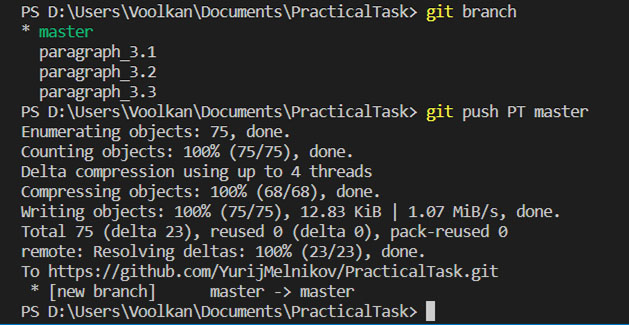

Командой *git push PT master* отправили, в ранее настроенный удалённый репозиторий *PT*, ветку *master* (внимание: имена чувствительны к регистру).

Далее перенесём в удалённый репозиторий дополнительную ветку:

>Git Push PT paragraph_3.1

Соответственно в удалённый репозиторий была перенесена ветка *paragraph_3.1*, к уже имеющейся основной ветке *master*.

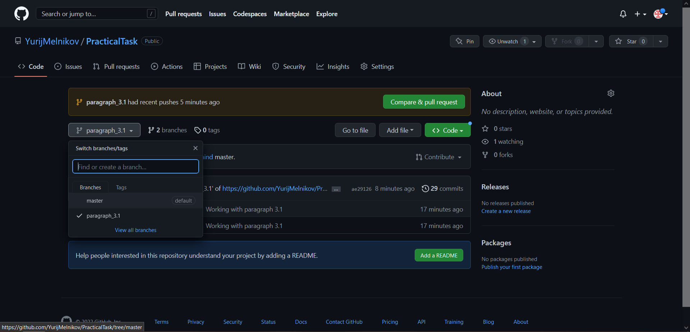

Так же можно добавлять в репозиторий файлы проекта, которые не нужно индексировать в *git*, например картинки - кнопкой Add file.

Для просмотра информации об удалённом репозитории, отслеживаемых ветках, URL адресе используется команда:

>Git remote show <имя репозитория>

Где "имя репозитория", короткое удобное имя, которое мы выбрали, когда связывали локальный и удалённый репозиторий командой *git remote add <имя> <URL удалённого репозитория>*

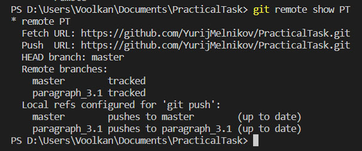

Так же имя удалённого репозитория при необходимости можно изменить командой:

>git remote rename <имя репозитория> <новое имя репозитория>

Соответственно данная команда изменит имя, заданное при выполнении команды *git remote add* на новое.

Если по какой-то причине нужно удалить удаленный репозиторий - можно использовать команду:

>git remote remove <имя репозитория>

При удалении - ссылки на удалённый репозиторий все отслеживаемые ветки и настройки, связанные с этим репозиторием, так же будут удалены.

### 3.2 Создание локального репозитория из удалённого на github.com ###

Допустим, у нас несколько устройств, с которых мы ведём работу над одним проектом и нам нужно перенести репозиторий на новое устройство. Полностью обновляем наш удалённый репозиторий до актуального состояния и используем команду:

>Git clone <URL удалённого репозитория>

В активной директории создаётся папка проекта с именем удалённого репозитория, в неё копируются все файлы репозитория и ветки. И автоматически назначается имя для удалённого репозитория *origin*

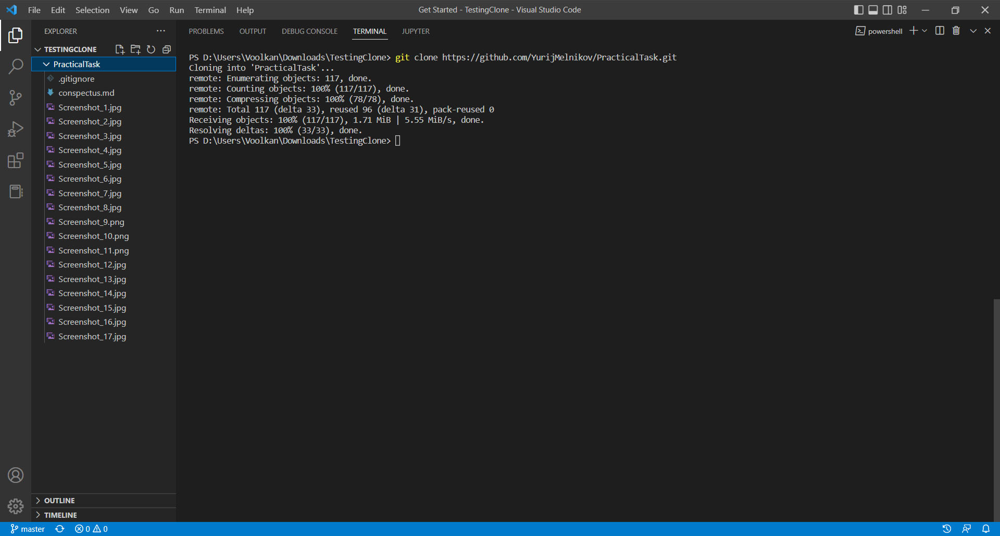

При вводе команды git branch будет видна только основная *master* ветка. Для просмотра всех веток, нужно использовать ключ -a

>git branch -a

И перейдя на нужную ветку командой git checkout <имя ветки>, она отобразится в списке git branch

Для удобства сменим название удалённого репозитория с *origin* на привычное *PT*:

>git remote rename origin PT

И проверим статус удалённого репозитория:

>git remote show PT

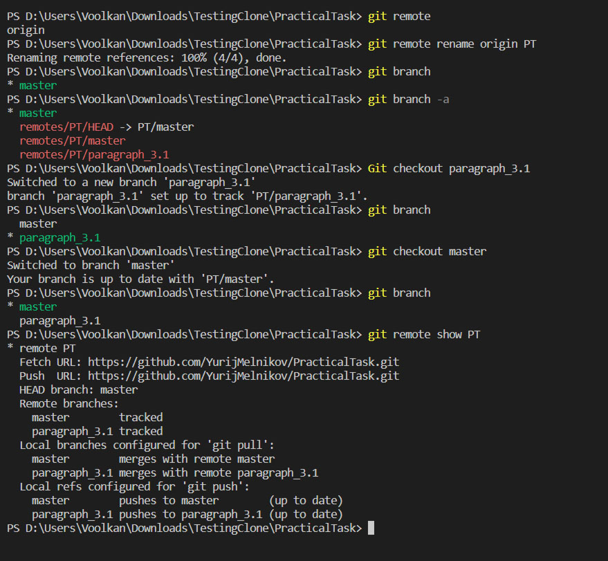

Мы создали полную копию нашего проекта и настроили для удобной работы. В дальнейшем при переходе между устройствами: командами *git push* обновляем удалённый репозиторий до актуального состояние и переносим из него на другое устройство актуальную версию проекта командой *git pull*.

### 3.3 Особенности команды *git pull* и *git push* ###

Разберём подробнее команду *git pull*

При обновлении локальных веток из удалённого репозитория командой *git pull* происходит попытка слияния (аналог *git merge*) с активной веткой. Если случайно запустили попытку вливания удалённой ветки репозитория не в ту ветку и это привело к конфликту - процесс можно отменить, так же, как и при конфликтах слияния локальных веток: командой

>git merge --abort

Существует гораздо более безопасный способ получить данные с удалённого репозитория командой *git fetch*

>git fetch <имя удалённого репозитория>

Данная команда создаёт дополнительные, локальные ветки, копии удалённых. Их можно просмотреть командой: 

>git branch -a

Эти ветки выделены красным. C ними можно работать, так же, как c обычными ветками, переходить на них командой *git checkout*, сливать с активной веткой, командой *git merge* ит.д. Так же любые изменения в этих дополнительных ветках не фиксируются коммитами.

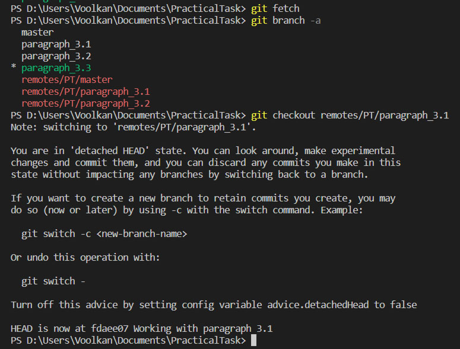

 Если нужно создать новую ветку на основе удалённой, можно воспользоваться командой, предварительно перейдя на нужную удалённую ветку:

 git switch -c <имя новой ветки>

 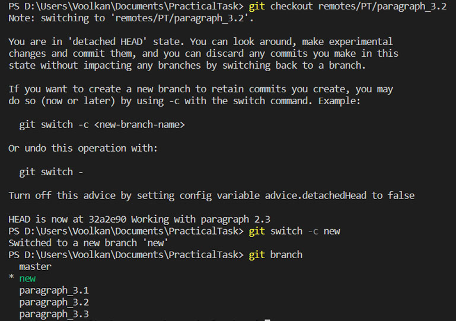

Данная команда создаст полноценную рабочую ветку с заданным именем, на основе активной удалённой, полученной командой *git fetch*

Команда *git pull* выполняет обратную функцию команды *git push*. То есть пытается слить активную ветку с одноимённой в удалённом репозитории. Если возникают конфликты, то слияния не произойдёт. Необходимо вначале слить её с локальной, командой *git push* (или *git fetch* с последующим слиянием *git merge*) и после разрешения конфликтов, уже воспользоваться командой *git pull*.

### 3.4 Работа над сторонними репозиториями github.com ###

Для работы над сторонними репозиториям на *github.com* существует функция *Fork* (англ. вилка).

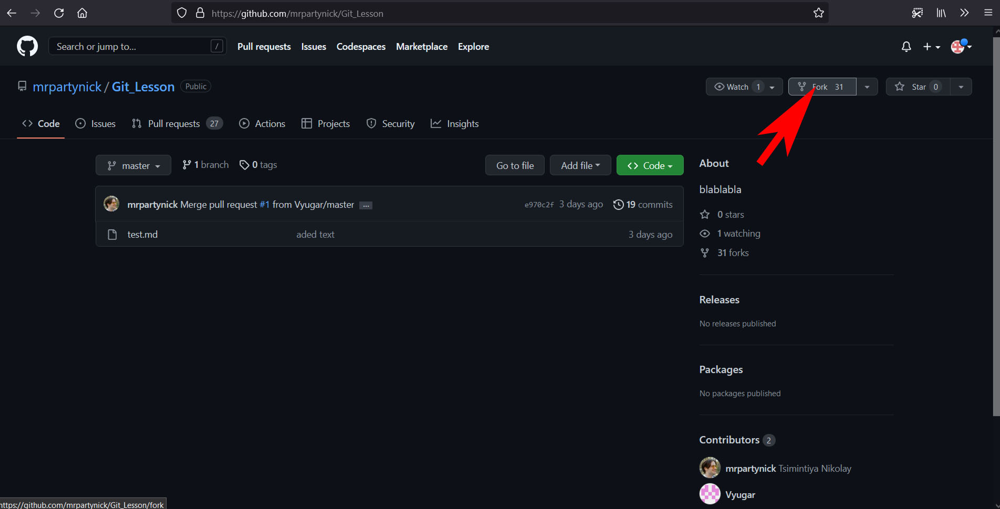

 При её использовании, сторонний репозиторий копируется на личный аккаунт и с ним можно работать, как с собственным. Так же можно дополнительно изменить его имя и описание, и указать, какие ветки копировать.

 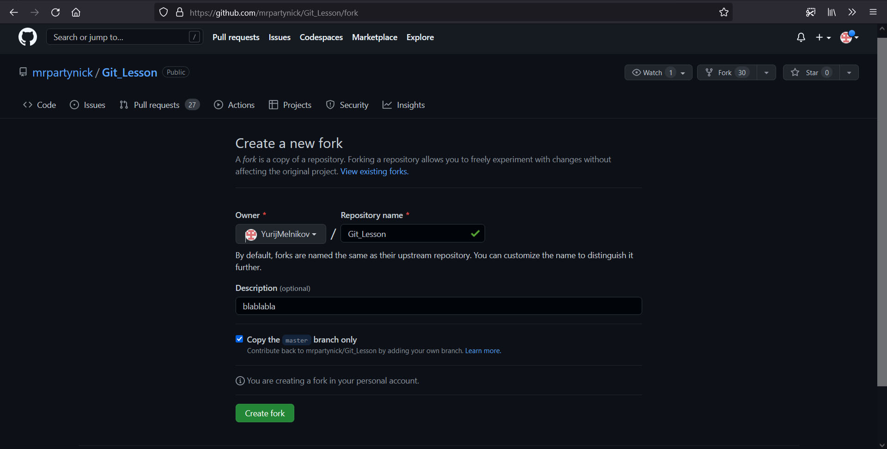

После завершения работы над сторонним репозиторием, если есть желание предложить результаты владельцу, есть возможность на сайте github.com предложить их, нажав кнопку  Pull request. Там же желательно оставить комментарий, с описанием проделанной работы. 

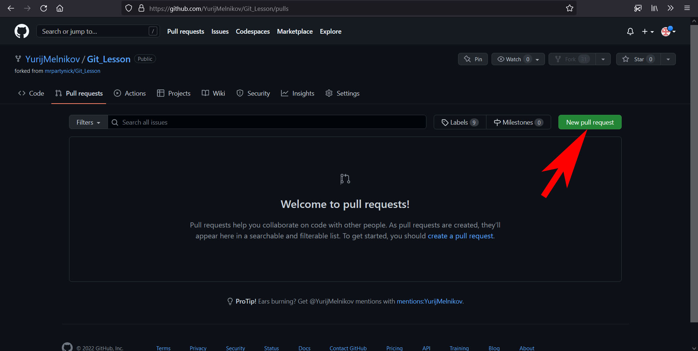

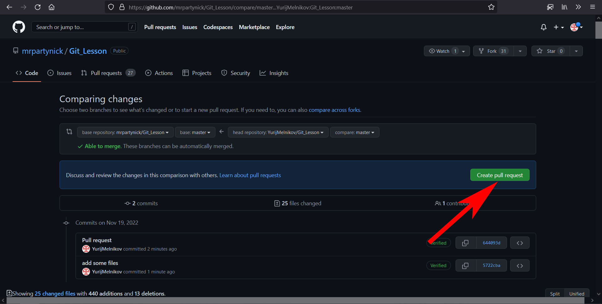

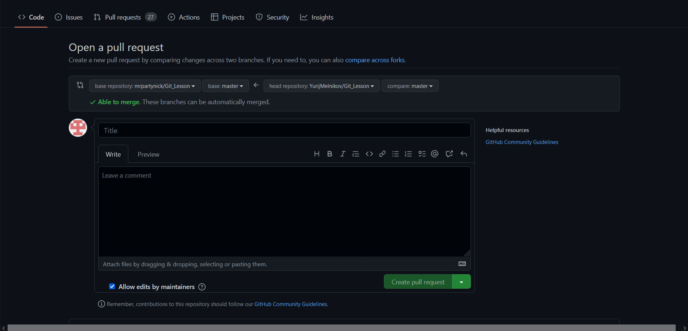

# Заключение #

Git является мощным и разносторонним инструментом в разработке и тестировании. Он позволяет максимально защитить проект от потерь данных, а так же эффективно организовать коллективную работу. Для обучающегося в IT сфере, важно понять принципы его работы и владеть на базовом уровне.
При создании этого конспекта, очень помогло руководство на официальном сайте *git*, написанное в максимально доступной и понятной форме.
[https://git-scm.com/book/ru/...](https://git-scm.com/book/ru/v2/%D0%92%D0%B2%D0%B5%D0%B4%D0%B5%D0%BD%D0%B8%D0%B5-%D0%9E-%D1%81%D0%B8%D1%81%D1%82%D0%B5%D0%BC%D0%B5-%D0%BA%D0%BE%D0%BD%D1%82%D1%80%D0%BE%D0%BB%D1%8F-%D0%B2%D0%B5%D1%80%D1%81%D0%B8%D0%B9)